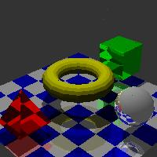
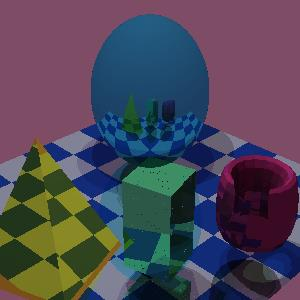

# raytracer-cosig
Ray Tracer developed by Cárina Alas (1181695@isep.ipp.pt) for COSIG.

Rendered images example:

References:

- Triangle intersection code taken from https://stackoverflow.com/questions/54617181/problem-in-rendering-triangle-mesh-with-reflections-in-webgl-and-opengles - tried following the pseudo code in the moodle documents, but they didn't quite work.
- Sphere intersection code taken from https://www.scratchapixel.com/lessons/3d-basic-rendering/minimal-ray-tracer-rendering-simple-shapes/ray-sphere-intersection
- Box intersection, mixture of slides, pseudo code from https://www.scratchapixel.com/lessons/3d-basic-rendering/minimal-ray-tracer-rendering-simple-shapes/ray-box-intersection
- Everything else, from the moodle documents for COSIG